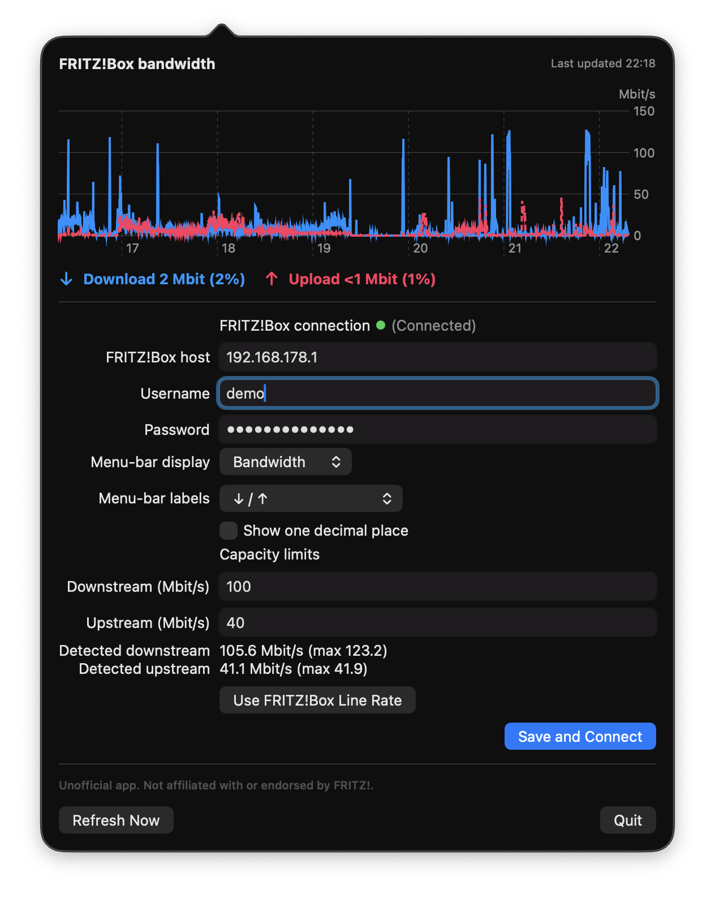

# FRITZ!Box Bandwidth Menu Bar

A native macOS menu-bar app which connects directly to the FRITZ!Box TR-064 API. It samples total WAN download and upload traffic, shows a graph for the retained history, and stores credentials in the macOS Keychain.

## Screenshots

Requirements: macOS 13 or newer and Xcode (or the Xcode Command Line Tools).

The development bundle above is unsigned. For normal distribution or automatic launch at login, create an Xcode macOS App target and sign/notarize it with your Apple Developer identity.

## Data model

- Sample interval: 10 seconds.
- Retention: 12 hours.
- Data source: the FRITZ!Box TR-064 `WANCommonInterfaceConfig` byte counters.
- Scope: whole-router Internet traffic, not individual devices.

## Disclaimer

FRITZ!Box is a FRITZ! product. This independent project is not affiliated with, endorsed by, or sponsored by FRITZ!.
